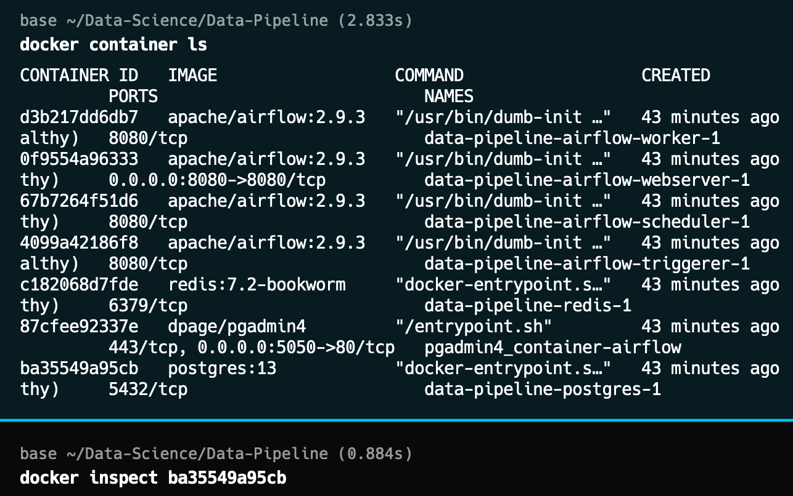
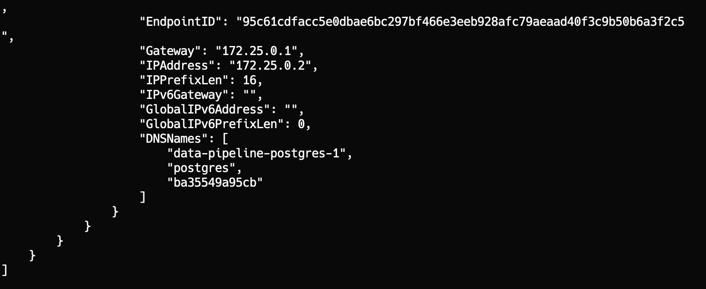

### Airflow ETL Pipeline Setup with Docker Compose


#### Pipeline Design


#### Overview

This guide explains how to set up an ETL pipeline using Airflow and Docker Compose to extract Amazon books data, transform it, and load it into a PostgreSQL database.

#### Steps

1. **Fetch `docker-compose.yaml`**
   ```bash
   curl -LfO 'https://airflow.apache.org/docs/apache-airflow/2.9.3/docker-compose.yaml'
   ```

2. **PostgreSQL and PGAdmin Configuration** 

##### Add this to the docker compose file to get the WebView of PG Admin 
   ```yaml
   pgadmin:
     container_name: pgadmin4_container-airflow
     image: dpage/pgadmin4
     restart: always
     environment:
       PGADMIN_DEFAULT_EMAIL: admin@admin.com
       PGADMIN_DEFAULT_PASSWORD: root
     ports:
       - "5050:80"
   ```

##### After Initializing Postgres and Pgadmin :
##### 1) Check you running docker containers and then inspect the container to get the IpAddress



## Now Copy Ipaddress from here and go Pgadmin 


1. **Initialize Environment**
   ```bash
   mkdir -p ./dags ./logs ./plugins ./config
   echo -e "AIRFLOW_UID=$(id -u)" > .env
   docker compose up airflow-init
   ```

#### And Then restart it by **Docker Compose Down** 

4. **Start Airflow Services**
   ```bash
   docker compose up
   ```

#### Directory Structure
- `./dags` - DAG files
- `./logs` - Task execution logs
- `./plugins` - Custom plugins
- `./config` - Configuration files

- **Source**: Amazon website
- **ETL Process**:
  - **Extract**: Web scraping with Python
  - **Transform**: Data cleaning using SQL
  - **Load**: Store data in PostgreSQL
- **Target**: Structured, Unstructured, Hybrid data

This setup allows for automated workflows managed by Airflow, executed within Docker containers for easy deployment and scaling.